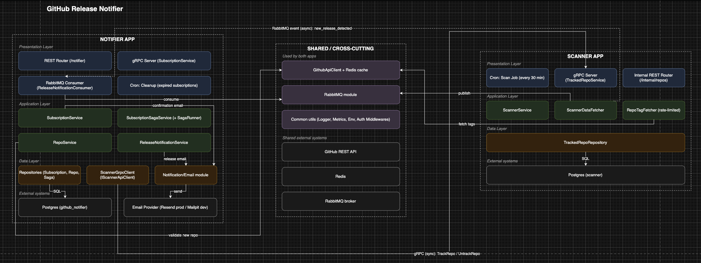

# Application Architecture

This document describes architecture of GitHub Release Notifier: how the two
applications are layered, what each layer is responsible for, and how dependencies are allowed to flow.
For system-level concerns (requirements, load estimation, DB schema, sequence diagrams) see [main.md](main.md).

## Diagram

## Overview

The system is split into two independently deployable applications, each following the same three-layer
structure (Presentation → Application → Data/Infra), plus a shared cross-cutting layer used by both.

- **`notifier`** — owns subscriptions, confirms/cancels them, and sends release emails
- **`scanner`** — owns tracked repositories, polls GitHub for new tags, and detects new releases

The two apps do not share a database — each owns its own Postgres instance and only exposes state to the
other through an explicit API (gRPC) or event (RabbitMQ). This keeps them independently deployable and
prevents one app's schema changes from silently breaking the other.

## Notifier app

**Presentation layer**
- REST Router (Express, mounted at `/notifier`) — subscribe / confirm / unsubscribe / list, behind
  `apiKeyMiddleware` and DTO validation
- gRPC Server (`SubscriptionService`) — mirrors the same four operations behind an auth interceptor
- RabbitMQ Consumer (`ReleaseNotificationConsumer`) — consumes `new_release_detected` events
- Cron job — hourly cleanup of expired, unconfirmed subscriptions

**Application layer**
- `SubscriptionService` — facade called by the REST/gRPC layer; orchestrates repo lookup, the subscribe/
  unsubscribe saga, and confirmation emails
- `SubscriptionSagaService` — orchestrates the subscribe/unsubscribe saga with compensating actions via
  `SagaRunner`
- `RepoService` — manages the notifier's local repo mirror
- `ReleaseNotificationService` — loads subscribers for a repo and triggers notification emails (used by the
  RabbitMQ consumer)

**Data / Infra layer**
- `SubscriptionRepository`, `RepoRepository`, `SagaRepository` — Drizzle repositories over notifier's own
  Postgres database
- `ScannerGrpcClient` (implements `IScannerApiClient`) — outbound gRPC calls to the scanner app

## Scanner app

**Presentation layer**
- Cron job (every 30 min) — triggers `ScannerService.run()`
- gRPC Server (`TrackedRepoService`) — `TrackRepo` / `UntrackRepo`, called by the notifier
- Internal REST Router (`/internal/repos`, api-key protected) — alternate track/untrack path

**Application layer**
- `ScannerService` — orchestrates a single scan cycle
- `ScannerDataFetcher` — loads tracked repos, publishes `new_release_detected`, updates the last-seen tag
- `RepoTagFetcher` — rate-limited (Bottleneck) per-repo tag lookups

**Data / Infra layer**
- `TrackedRepoRepository` — Drizzle repository over the scanner's own Postgres database (separate instance
  from the notifier's)

## Shared / cross-cutting layer

Used by both apps, sitting underneath the layers above:

- `GithubApiClient` (implements `TagFetcher`) + Redis-backed response cache
- RabbitMQ module (`EventPublisher` / `EventConsumer` wrapper)
- Notification/email module (notifier only) — `EmailSenderFactory` → Resend (production) / Mailpit via SMTP
  (development)
- Logger (Winston: console + Elasticsearch transport), metrics (prom-client registry), env/config, the
  `Either` functional error type, and auth middlewares

## External systems

- Postgres — `github_notifier` DB (notifier only)
- Postgres — `scanner` DB (scanner only, separate instance)
- Redis — shared cache
- RabbitMQ — shared broker
- GitHub REST API — external
- Resend API / Mailpit — external email delivery

## Dependency rules

- Presentation depends on Application; Application depends on Data/Infra — never the reverse
- Application and Data/Infra layers depend on abstractions (repository/client interfaces), not concrete
  implementations, so infra can be swapped (e.g. `ScannerGrpcClient` vs a REST equivalent) without touching
  business logic
- The two apps never share a database; all cross-app interaction goes through the gRPC client/server pair
  or the RabbitMQ event, keeping them independently deployable

## Observations

- The scanner's gRPC server (`TrackedRepoService`) and its internal REST router (`/internal/repos`) both
  resolve `TrackedRepoRepository` directly from the container, bypassing the Application layer
  (`ScannerService`) that the cron scan path goes through. This is a minor layering inconsistency — track/
  untrack requests skip the layer that the rest of the app uses — flagged here rather than fixed, since it's
  out of scope for this document.

## Cross-app communication

- **Notifier → Scanner (gRPC, synchronous)**: `ScannerGrpcClient.trackRepo` / `untrackRepo`, called as part
  of the subscribe/unsubscribe saga
- **Scanner → Notifier (RabbitMQ, asynchronous)**: `ScannerDataFetcher` publishes `new_release_detected` on
  the `releases` exchange; the notifier's `ReleaseNotificationConsumer` consumes it and triggers emails
