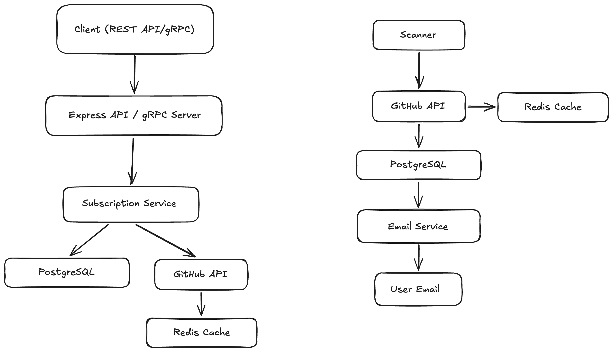
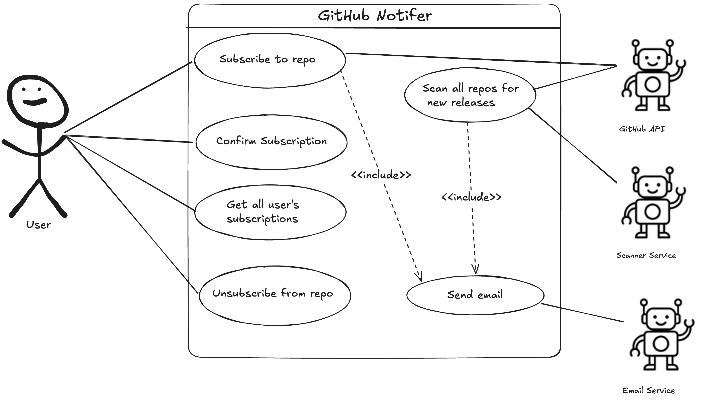
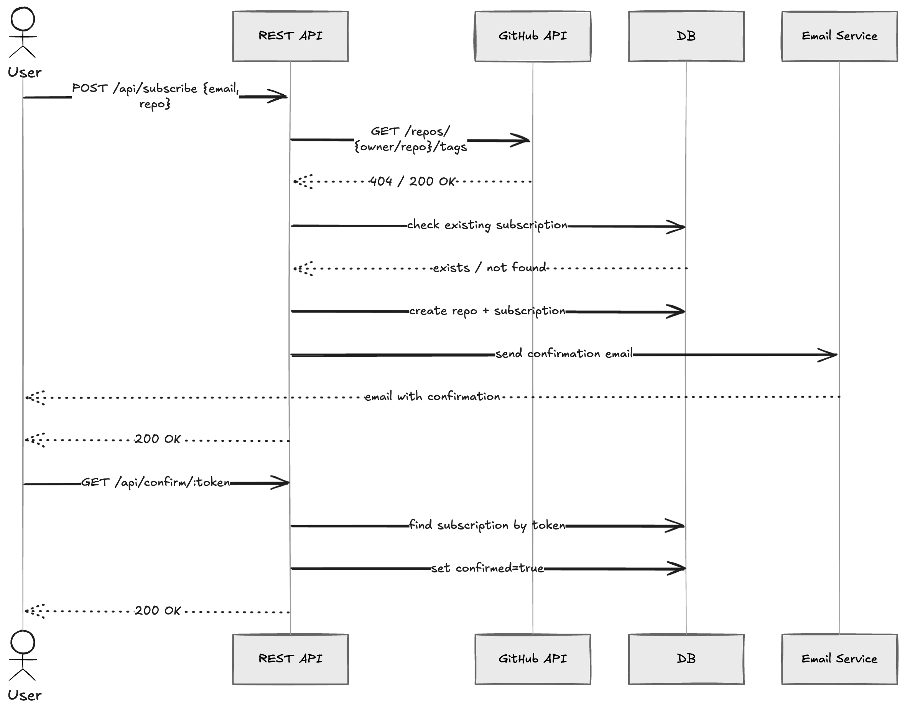

# System Design: GitHub Release Notifier

## Context:
Github does not provide a built-in email notification for new repository releases. So developers need to manually check for updates
and it's easy to miss. The system solves this problem by letting users subscribe to any GitHub repository and received an email
automatically when a new release is published
---

## 1. System requirements

### Functional requirements
- User can subscribe an email to a GitHub repository to receive new release notifications
- The system must validate GitHub repository before creating a subscription
- Each subscription must be confirmed using email link before it becomes active
- User can unsubscribe from a repository using a token from email
- User can get all his active subscriptions by email
- The system should periodically scan all repositories for new release tag
- When a new release tag is detected, the system should send an email notification to every subscription of that repository
- Support multiple API protocols (REST API, gRPC)

### Non-Functional Requirements
- Release notifications must be delivered within 30 minutes of a new GitHub release
- The system must handle up to 2,500 tracked repositories and 10,000 active subscriptions
- API endpoints must respond within 500ms under normal load
- No duplicate notifications for the same release per subscriber
- System availability must be > 99.5%

### Constraints
- GitHub API: 5,000 req/hour per token limits repository polling
- Email delivery: Resend free tier caps at 100 email/day, because of free tier
- Deployment: Single instance only, horizontal scaling would cause duplicate notification

## 2. Load Estimation

### Users and traffic
- __Active users__: ~5,000
- __Subscriptions per user__: 2-3 (avg) -> ~12,500 total active subscriptions
- __Peak API traffic__: ~20 RPS
- __Notification emails__: ~500/day

### Data
- __Subscription__: ~200 bytes
- __Repository record__: ~150 bytes
- __Total BD at full capacity__: ~5MB
- __GitHub API response data__: ~15 MB per scan cycle

### Bandwith
- __Incoming__: ~0.1 Mbps
- __Outgoing__: ~0.2 Mbps (emails, webhooks)
- __External API__: ~0.1 Mbps

## 3. High-Level Architecture



## 4. Detailed Design

### 4.1 REST API (Node.js/Express)

Responsibilities:
- Handle incoming HTTP requests
- API key authentication for routes
- Requests validation using DTOs
- Expose Prometheus metrics and API docs

Endpoints
```
  POST   /api/subscribe            — subscribe email to repo (API key required)
  GET    /api/confirm/:token       — confirm subscription (public)
  GET    /api/unsubscribe/:token   — unsubscribe (public)
  GET    /api/subscriptions?email= — list active subscriptions (API key required)
  GET    /metrics                  — Prometheus metrics
  GET    /docs                     — Swagger UI
  GET    /                         — health check
```

Scaling: vertical only - cron scanner prevents safe horizontal scaling

### 4.2  gRPC Server

Responsibilities
- Mirror all subscription operations over gRPC (port 50051)
- Shares the same SubscriptionService as the REST API

Methods
```
Subscribe(SubscribeRequest)           -> MessageResponse  (API key required)
Confirm(TokenRequest)                 -> MessageResponse
Unsubscribe(TokenRequest)             -> MessageResponse
GetSubscriptions(GetSubscriptionsRequest) -> GetSubscriptionsResponse (API key required)
```

Proto: src/grpc/subscription.proto

### 4.3 Scanner Service

Responsibilities
- Check all repos for new release tags every 30 minutes
- Compare latest tag from GitHub against `last_seen_tag` stored in DB
- Trigger email notifications for repos with a new tag
- Update `last_seen_tag` after successful notification

__Rate limiting__: Bottleneck library caps GitHub API usage at 5 000 calls/h with 10 max concurrent request - stays

__Scan flow__
1. Load all repos from DB
2. Fetch latest tag for each repo using GitHub API
3. Filter repos where latestTag !== last_seen_tag
4. Load confirmed subscribers for those repos
5. Send release notification emails
6. Update last_seen_tag in DB

### 4.4 GitHub API Client

Responsibilities
- Fetch latest release tags from GitHub REST API
- Handle rate limit (429) responses
- Cache responses to avoid redundant API calls

__Rate limit handling__: on 429 response, parse `Retry-After` header, return time until the next execution

### 4.5 Notification Email Service

Responsibilities
- Send release notification emails when a new tag is released

- __Production__: Resend HTTP API
- __Development__: Mailpit using nodemailer

## 5. Testing

System is covered by unit and integration test

### Unit tests
All dependencies are mocked (no real DB). Cover subscription service logic, HTTP route handling, GitHub API client and scanner service
with its tag

### Integration tests
Run a real PostgreSQL and Redis using testcontainers and test full subscription flow, from subscribing to receiving notifications.

## 6. Reliability after 3 months

- CI runs on every push (linting, type-check, tests)
- Prometheus metrics

## 7. Database Schema

repos

| Column         | Type      | Constraints                  |
  |----------------|-----------|------------------------------|
| id             | uuid      | PK, auto-generated           |
| repo           | text      | NOT NULL, UNIQUE             |
| last_seen_tag  | text      | NOT NULL                     |
| checked_at     | timestamp | NOT NULL, default now        |

subscriptions

| Column      | Type      | Constraints                          |
  |-------------|-----------|--------------------------------------|
| id          | uuid      | PK, auto-generated                   |
| email       | text      | NOT NULL                             |
| repo_id     | uuid      | FK → repos.id, CASCADE DELETE        |
| token       | uuid      | NOT NULL, auto-generated             |
| confirmed   | boolean   | NOT NULL, default false              |
| created_at  | timestamp | NOT NULL, default now                |

## 8. Use-Case Diagram



## 9. Sequence Diagram


